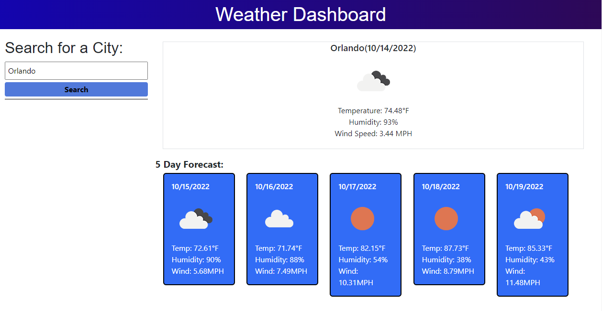

# weather-forecast-api
This application allows the user to search for a desired location and see real time weather as well as a five day forecast.

## Description
This application is designed to retrieve data though an API from OpenWeather and display it for the user. Using the API, the user is able to search for a city and receive data for the day as well as a five day forecast.

